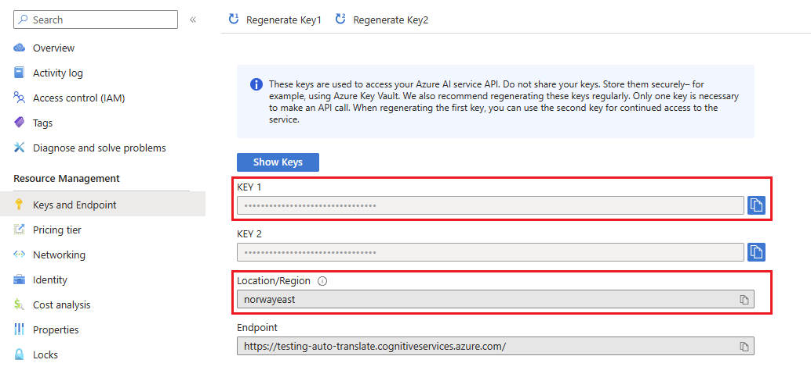
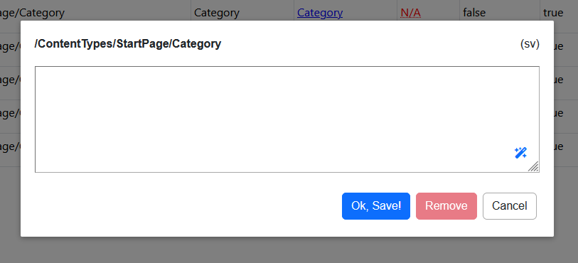

# Cloud Translators

If your editors are having timing issues translating the content it's now possible to add cloud based translators and leverage power of cloud.

Currently supported translators:

* Azure Cognitive Services

## Getting Started

To enable Microsoft Azure Cognitive Services as translator for Localization Provider follow these steps:

* Create Cognitive Services instance in Azure
* Copy **Access Key** and **Region**



* Add Cognitive Services registration to your Localization Provider setup code:

```csharp
public void ConfigureServices(IServiceCollection services)
{
    services.AddDbLocalizationProvider(x =>
    {
        x.UseAzureCognitiveServices("{access-key}", "{region}");

        // rest of the provider configuration...
    });
}
```

You should better read values from `appsettings.json` file or any other secure storage of your choice (like [Azure KeyVault](https://azure.microsoft.com/en-us/products/key-vault)).

After you have configured cloud translator successfully, editors will have easy and fast way to translate resources with a magic wand.

